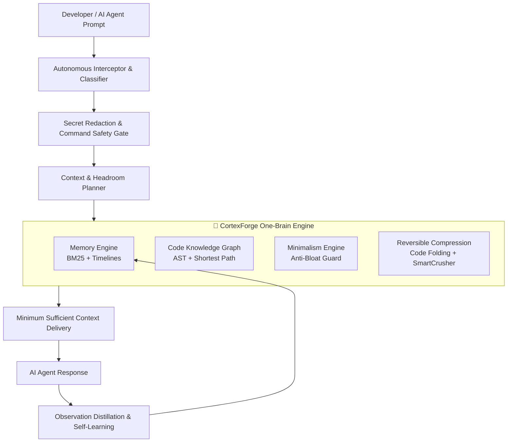

# CortexForge User Manual 🧠📖
> **A Comprehensive, Beginner-Friendly Guide to Autonomous Developer Intelligence**

---

## 📑 Table of Contents
1. [Welcome to CortexForge: What is It?](#1-welcome-to-cortexforge-what-is-it)
2. [Why Do You Need It? (How It Helps You)](#2-why-do-you-need-it-how-it-helps-you)
3. [How It Works (Under the Hood — Made Simple)](#3-how-it-works-under-the-hood--made-simple)
4. [Getting Started in 2 Minutes (Installation)](#4-getting-started-in-2-minutes-installation)
5. [Everyday Usage: How to Use CortexForge](#5-everyday-usage-how-to-use-cortexforge)
6. [The Interactive Web Dashboard](#6-the-interactive-web-dashboard)
7. [CLI Command Reference with Real Examples](#7-cli-command-reference-with-real-examples)
8. [Real-World Walkthroughs & Practical Scenarios](#8-real-world-walkthroughs--practical-scenarios)
9. [Frequently Asked Questions & Troubleshooting](#9-frequently-asked-questions--troubleshooting)
10. [Quick Reference Cheat Sheet](#10-quick-reference-cheat-sheet)

---

## 1. Welcome to CortexForge: What is It?

### The Plain English Explanation
Imagine you are working with a brilliant software engineer, but they have two frustrating flaws:
1. Every time you open a new chat session, they suffer complete amnesia—forgetting your architectural decisions, past bug fixes, and project rules.
2. Their working desk (the LLM context window) is small and expensive. As soon as you paste a few big files or log outputs, their desk gets cluttered, they start forgetting earlier instructions, and your API bill skyrockets.

**CortexForge fixes this permanently.**

CortexForge is an **autonomous intelligence layer** that runs quietly in the background of your coding agent (**Claude Code**, **Cursor**, **Google Antigravity**, **Gemini CLI**, **GitHub Copilot**, **Codex**, or **Kiro**). It acts as:
- **A Permanent Engineering Brain**: Remembers every decision, bug fix, and architectural choice across all sessions.
- **A Master Cartographer**: Maps every file, function, class, and dependency across your codebase into an interactive knowledge graph.
- **A Context Optimizer**: Compresses noisy files and tabular data by 60% to 90% without losing a single piece of information.
- **A Senior Code Reviewer**: Stops the AI from writing bloated, over-engineered code and passthrough wrappers.
- **A Security Guard**: Automatically redacts API keys and blocks destructive shell commands before they run.

---

## 2. Why Do You Need It? (How It Helps You)

Here is a breakdown of the 5 biggest pain points with AI coding agents and how CortexForge solves each one:

```
┌──────────────────────────────────────┬──────────────────────────────────────┐
│ The Pain Point Without CortexForge   │ How CortexForge Solves It            │
├──────────────────────────────────────┼──────────────────────────────────────┤
│ 1. AI Amnesia                        │ Persistent Memory Engine             │
│    Every new session starts from     │ Stores facts, bug fixes, and rules   │
│    zero. You have to re-explain the  │ in a fast local BM25 database. Auto- │
│    project over and over.            │ retrieves them when relevant.        │
├──────────────────────────────────────┼──────────────────────────────────────┤
│ 2. Context Window Waste & High Cost  │ SmartCrusher & ULTRA Compression     │
│    Large JSON files, stack traces,   │ Compresses data by 60-90% with 100%  │
│    and code dumps fill the context.  │ reversibility using SHA-256 handles. │
├──────────────────────────────────────┼──────────────────────────────────────┤
│ 3. Blind Edits & Broken Dependencies │ Polyglot Code Knowledge Graph        │
│    AI changes a function in one      │ Maps calls and dependencies across   │
│    file and breaks 5 other files     │ files; computes shortest paths and   │
│    it didn't know existed.           │ blast radius before touching code.   │
├──────────────────────────────────────┼──────────────────────────────────────┤
│ 4. "AI Slop" & Over-Engineering      │ Ponytail-Inspired Minimalism Engine  │
│    AI introduces 6 unnecessary       │ Automatically audits diffs, flags    │
│    factories, wrappers, and abstract │ passthrough wrappers, and tracks     │
│    classes for a 5-line feature.     │ lines of avoidable code saved.       │
├──────────────────────────────────────┼──────────────────────────────────────┤
│ 5. Security & Accidental Deletions   │ Autonomous Interceptor & Guard       │
│    Accidental `rm -rf /` or leaked   │ Blocks destructive commands and      │
│    OpenAI/Anthropic API keys.        │ redacts secrets before sending them. │
└──────────────────────────────────────┴──────────────────────────────────────┘
```

---

## 3. How It Works (Under the Hood — Made Simple)

CortexForge is built on a **One-Brain unified architecture**. Instead of running six disjointed tools, all subsystems share a single, lightning-fast local SQLite/JSON database (`.cortexforge/cortex.db.json`).



### The Six Subsystems:
1. **Memory Engine**: Uses BM25 lexical ranking combined with recency and evidence tiers (`FACT`, `HISTORICAL`, `INFERENCE`) to recall project decisions.
2. **Code Knowledge Graph**: Parses TypeScript, JavaScript, Python, Go, Rust, and SQL without heavy native compilers. Calculates shortest dependency paths (Dijkstra), God Nodes (high-degree bottlenecks), and community clusters.
3. **Context & Headroom Planner**: Ensures your prompts never exceed safe token limits by calculating headroom buffers (minimum 25% safety margin) and aligning static prefixes for prompt caching.
4. **Reversible Compression & CodeFolder**: Uses AST-free indentation folding to outline code files (70-85% token reduction) and tabular matrix crushing for JSON. Every compression emits a `CF_REC_<hash>` handle that can restore the exact original text.
5. **Minimalism Engine**: Detects passthrough wrappers, speculative single-implementation factories, and empty interfaces. Calculates an objective "Lines of Code Saved" scoreboard.
6. **Self-Optimizer & Observation Extractor**: Automatically reads the output of tests, linters, and compiler errors, distills the root causes, and saves them to memory so the AI never repeats the same mistake twice.

---

## 4. Getting Started in 2 Minutes (Installation)

CortexForge requires **Node.js v22+** and has **zero external npm dependencies** (it runs entirely on native standard libraries).

### Step 1: Install CortexForge Globally
Clone the repository into your global agents skills directory:

**Windows (PowerShell):**
```powershell
git clone https://github.com/khushahalgroup/cortexforge.git "$HOME\.agents\skills\cortexforge"
```

**macOS / Linux:**
```bash
git clone https://github.com/khushahalgroup/cortexforge.git ~/.agents/skills/cortexforge
```

---

### Step 2: Connect to Your Preferred Agent

#### A. For Google Antigravity & Claude Code
Create a symlink so the agent automatically recognizes CortexForge as a skill:
```powershell
# Windows PowerShell
New-Item -ItemType SymbolicLink -Path "$HOME\.gemini\antigravity-cli\skills\cortexforge" -Target "$HOME\.agents\skills\cortexforge"
```

#### B. For Cursor & VS Code
Add CortexForge as an MCP (Model Context Protocol) server. In your Cursor MCP settings (`~/.cursor/mcp.json` or project settings):
```json
{
  "mcpServers": {
    "cortexforge": {
      "command": "node",
      "args": ["--experimental-strip-types", "C:/Users/anjan/.agents/skills/cortexforge/src/server/mcp.ts"],
      "cwd": "C:/Users/anjan/.agents/skills/cortexforge"
    }
  }
}
```

#### C. For Gemini CLI / Antigravity CLI MCP
Add to your `gemini-extension.json` or `config.json`:
```json
{
  "mcpServers": {
    "cortexforge": {
      "command": "node",
      "args": ["--experimental-strip-types", "src/server/mcp.ts"],
      "cwd": "C:/Users/anjan/cortexforge"
    }
  }
}
```

---

### Step 3: Run the Health Check
Verify that everything is set up correctly:
```bash
node --experimental-strip-types bin/cortexforge.js doctor
```

Output:
```text
=== CortexForge Health Diagnostic ===
[PASS] Project Root: C:\Users\anjan\cortexforge
[PASS] Database: Initialized and healthy (14 memories, 96 graph nodes)
[PASS] Worker: Ready on port 49210
[PASS] Tests: 169/169 Passing
All systems operational.
```

---

## 5. Everyday Usage: How to Use CortexForge

You can interact with CortexForge in three ways depending on how you like to work:

### Mode 1: Completely Invisible (Zero-Configuration)
You don't have to do anything special! 
- When you ask your agent to fix a bug, CortexForge automatically checks past memories to see how similar bugs were solved.
- When your agent reads code, CortexForge can fold large functions to fit within the prompt.
- When tests fail, CortexForge automatically extracts the lesson and writes it to memory.

### Mode 2: The Interactive Web Dashboard
Run the dashboard server to get a visual bird's-eye view of your project:
```bash
node --experimental-strip-types bin/cortexforge.js start
```
Open **`http://127.0.0.1:49210/dashboard`** in your browser. (See [Section 6](#6-interactive-web-dashboard) for a full breakdown).

### Mode 3: The Command Line Interface (CLI)
Run fast checks directly from your terminal:
```bash
# Search memory for past technical decisions:
node --experimental-strip-types bin/cortexforge.js memory "database"

# Check for architectural violations or circular imports:
node --experimental-strip-types bin/cortexforge.js drift
node --experimental-strip-types bin/cortexforge.js cycles

# Audit your code for unnecessary complexity:
node --experimental-strip-types bin/cortexforge.js audit
```

---

## 6. The Interactive Web Dashboard

When you run `cortexforge start`, CortexForge launches a fast, native HTTP dashboard at:
👉 **`http://127.0.0.1:49210/dashboard`**

```
┌────────────────────────────────────────────────────────────────────────┐
│  🧠 CORTEXFORGE DEVELOPER INTELLIGENCE DASHBOARD                       │
│  Host: Google Antigravity | Project: cortexforge | Status: ACTIVE      │
├────────────────────────────────────────────────────────────────────────┤
│  [96] Graph Nodes   [14] Memories   [408] Tokens Saved   [0.00] Drift │
├────────────────────────────────────────────────────────────────────────┤
│  ┌──────────────────────────────┐  ┌─────────────────────────────────┐ │
│  │ 🌐 Architectural Topology    │  │ ⚡ God Nodes & Bottlenecks      │ │
│  │ (Live Mermaid Diagram)       │  │ 1. AgentDetector (Degree: 8)    │ │
│  │                              │  │ 2. MemoryEngine (Degree: 7)     │ │
│  │ [Presentation]               │  │ 3. CodeGraph    (Degree: 6)     │ │
│  │        ↓                     │  └─────────────────────────────────┘ │
│  │ [Application]                │  ┌─────────────────────────────────┐ │
│  │        ↓                     │  │ 📦 Functional Communities       │ │
│  │ [Domain]                     │  │ • Module A (src/memory)         │ │
│  │        ↓                     │  │ • Module B (src/graph)          │ │
│  │ [Infrastructure]             │  │ • Module C (src/compression)    │ │
│  └──────────────────────────────┘  └─────────────────────────────────┘ │
│  ┌───────────────────────────────────────────────────────────────────┐ │
│  │ 🧠 Recent Engineering Decisions & Facts                           │ │
│  │ • [FACT] BM25 Term Frequency Idempotency                          │ │
│  │ • [FACT] Polyglot AST Relative Path Normalization                 │ │
│  │ • [FACT] SmartCrusher Array Type Disambiguation                   │ │
│  └───────────────────────────────────────────────────────────────────┘ │
└────────────────────────────────────────────────────────────────────────┘
```

### What Each Panel Tells You:
1. **Metrics Bar**: Instant stats on total symbols mapped, memories stored, token budget saved, and architecture drift score.
2. **Architectural Topology**: An automatically generated diagram showing how data and imports flow across your project layers.
3. **God Nodes**: Symbols that have too many connections. These are your repository's biggest single points of failure.
4. **Functional Communities**: Automatically detects which files belong to the same functional cluster using community detection.
5. **Memory Stream**: Real-time log of lessons and decisions your agent has learned.
6. **Cave Scorecard**: Quantifies how many tokens and dollars CortexForge has saved you this session.

---

## 7. CLI Command Reference with Real Examples

All commands are executed using `node --experimental-strip-types bin/cortexforge.js <command>` (or `cortexforge <command>` if added to your PATH).

### 1. Memory Commands
```bash
# Search memory for a keyword or concept
cortexforge memory "authentication"

# Generate a cold-start briefing summarizing current project focus
cortexforge briefing

# View chronological timeline of decisions and test events
cortexforge timeline
```

### 2. Code Knowledge Graph Commands
```bash
# List God Nodes (over-connected bottleneck classes/functions)
cortexforge god-nodes

# Find the shortest dependency path between two symbols
cortexforge path "AgentDetector" "CortexDatabase"

# Calculate the "blast radius" (what breaks if I change this symbol?)
cortexforge blast-radius "MemoryEngine"

# Detect circular dependencies across the project
cortexforge cycles

# Group codebase into modular clusters
cortexforge communities
```

### 3. Architecture & Quality Commands
```bash
# Check if imports violate layer boundaries (e.g. Domain importing Presentation)
cortexforge drift

# Scan code for over-engineering (passthrough wrappers, unnecessary factories)
cortexforge audit

# Audit uncommitted git diff before committing
cortexforge review
```

### 4. Context & Compression Commands
```bash
# Fold all function implementations in a file to save tokens
cortexforge fold src/memory/memoryEngine.ts

# Crush a large JSON data file into a compact matrix format
cortexforge crush test-data.json

# Check your cumulative token and dollar savings
cortexforge scorecard

# Restore raw content from a reversible compression handle
cortexforge recover CF_REC_a8f902...
```

---

## 8. Real-World Walkthroughs & Practical Scenarios

### Scenario A: Joining a Large, Unfamiliar Repository
**Problem**: You just cloned a 50,000-line codebase. The agent doesn't know where to start and wastes thousands of tokens reading random files.
**CortexForge Solution**:
1. Run `cortexforge briefing`. CortexForge inspects entrypoints, package manifests, and architecture layers to produce a clean 1-page summary.
2. Run `cortexforge god-nodes`. Immediately see the 5 most critical hub files that drive the entire project.
3. Your agent now understands the codebase without reading thousands of unnecessary lines.

---

### Scenario B: Refactoring a Core Function Safely
**Problem**: You want to change the signature of `parseAst()` in `astParser.ts`, but you're afraid it will break hidden consumers.
**CortexForge Solution**:
1. Run `cortexforge blast-radius "parseAst"`.
2. CortexForge traverses the dependency graph and returns every single function, class, and test that directly or indirectly calls `parseAst`.
3. You can give this exact list to your AI agent: *"Refactor `parseAst` and update these 4 dependent callers: [...]"*.

---

### Scenario C: Preventing AI From Writing Bloated Code
**Problem**: You asked the AI for a simple caching utility, and it generated 5 files: `ICacheProvider.ts`, `CacheFactory.ts`, `AbstractCacheService.ts`, `RedisCacheAdapter.ts`, and `CacheConfigDTO.ts`.
**CortexForge Solution**:
1. Run `cortexforge audit` or `cortexforge review`.
2. CortexForge flags the smells:
   - `[OVERENGINEERING] Premature single-implementation factory: CacheFactory`
   - `[OVERENGINEERING] Trivial passthrough wrapper: CacheService -> RedisCacheAdapter`
   - `[SAVINGS] 85 lines of avoidable boilerplate identified.`
3. The AI is forced to simplify the code to a clean, direct 15-line implementation.

---

### Scenario D: Passing 2MB of API Logs or Data into Context
**Problem**: You have a 5,000-line API JSON response or error log. Pasting it blows past your LLM context limit or costs $0.50 in a single turn.
**CortexForge Solution**:
1. Run `cortexforge crush api_response.json` (for JSON) or use `ContextCompressor.compress()` (for logs).
2. The payload is reduced by 75%, replacing repetitive keys with a tabular schema, and assigning a handle: `CF_REC_e4d912...`.
3. The AI analyzes the data with complete accuracy. If it ever needs to inspect a raw line byte-for-byte, it simply calls `cortexforge recover CF_REC_e4d912...`.

---

## 9. Frequently Asked Questions & Troubleshooting

#### Q: Does CortexForge send my code or data to external servers?
**No.** CortexForge is **100% offline and local**. All knowledge graphs, memories, and databases are stored on your local drive in the `.cortexforge/` folder inside your project. No third-party APIs or telemetry services are ever contacted.

#### Q: Does CortexForge slow down my coding agent?
**No.** CortexForge has **zero external dependencies** and uses native Node.js streams and regexes. Operations like graph pathfinding and memory searches take **under 10 milliseconds**. By eliminating 60–90% of token bloat, your agent actually responds significantly faster.

#### Q: How does the AI remember things between sessions?
When you or the agent run a command that resolves a problem, CortexForge's `ObservationExtractor` extracts the problem, root cause, and fix. It stores this in `.cortexforge/cortex.db.json`. At the beginning of every subsequent session, the `CacheAligner` loads relevant memories into the agent's static context prefix.

#### Q: What should I do if the background worker won't start?
1. Check if the port is already in use:
   ```bash
   netstat -ano | findstr 49210
   ```
2. Run `cortexforge doctor` to verify file permissions and state integrity.
3. You can safely remove `.cortexforge/worker.pid` if an old process was terminated abruptly.

#### Q: How do I run the full automated test suite?
CortexForge includes 169 automated stress and unit tests. You can run them anytime:
```bash
node --experimental-strip-types tests/unit.test.ts
node --experimental-strip-types tests/stress_and_edge_cases.test.ts
```

---

## 10. Quick Reference Cheat Sheet

| Task | Command |
| :--- | :--- |
| **Start Local Dashboard** | `node --experimental-strip-types bin/cortexforge.js start` |
| **System Diagnostics** | `node --experimental-strip-types bin/cortexforge.js doctor` |
| **Search Memory** | `node --experimental-strip-types bin/cortexforge.js memory "<keyword>"` |
| **Project Briefing** | `node --experimental-strip-types bin/cortexforge.js briefing` |
| **Identify Bottlenecks** | `node --experimental-strip-types bin/cortexforge.js god-nodes` |
| **Shortest Path** | `node --experimental-strip-types bin/cortexforge.js path "<symbolA>" "<symbolB>"` |
| **Blast Radius** | `node --experimental-strip-types bin/cortexforge.js blast-radius "<symbol>"` |
| **Audit Over-engineering** | `node --experimental-strip-types bin/cortexforge.js audit` |
| **Review Git Diff** | `node --experimental-strip-types bin/cortexforge.js review` |
| **Fold Large File** | `node --experimental-strip-types bin/cortexforge.js fold <path/to/file>` |
| **Crush JSON Data** | `node --experimental-strip-types bin/cortexforge.js crush <path/to/data.json>` |
| **View ROI Scorecard** | `node --experimental-strip-types bin/cortexforge.js scorecard` |
| **Check Architecture Drift** | `node --experimental-strip-types bin/cortexforge.js drift` |
| **Find Dependency Cycles** | `node --experimental-strip-types bin/cortexforge.js cycles` |
| **Run Benchmark** | `node --experimental-strip-types bin/cortexforge.js benchmark` |

---
*CortexForge: Making AI coding agents persistent, minimal, architecture-aware, and exceptionally efficient.*
